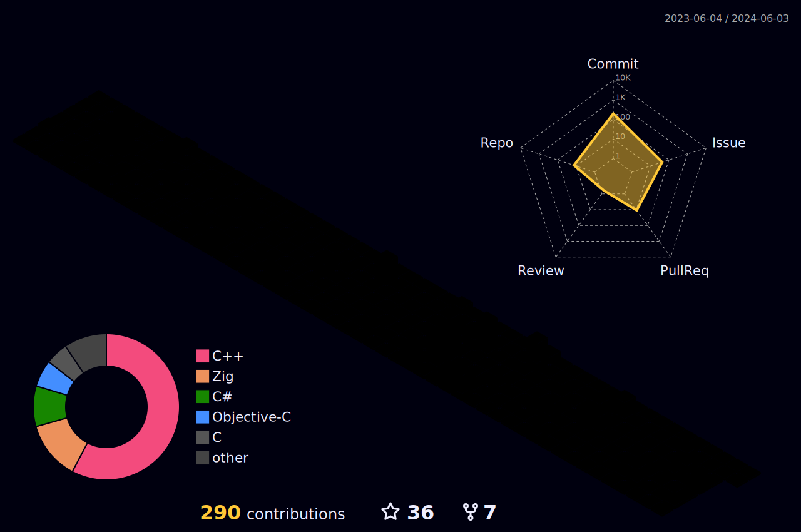

  <!---->

   
  
  <h3> Welcome to my page! Hope you like it ^_^ </h3>
    <h3> You may also be interested in checking <a href="https://community.openai.com/u/nranzo/summary">my openai personal page</a>. </h3>      
        <h3> Please note that the following animation is NOT already synchronized to my profile's activity log! </h3>

   
  
  

   
   
   

  <h3> You can support me by starring some of my repositories! </h3>

   
  
  

  <h3> (you can see my pattern defeating quicksort up here) </h3>
  
   
  
  <h3> Thank you! </h3>

